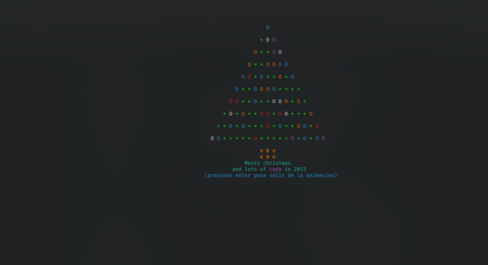

# Descripcion 

Primer Proyecto Final, para la materia de Logica de Programacion.
Este es un programa el cual muestra la animación de un árbol de navidad Navidad animado con colores hecho completamente en C (aunque posea la extension cpp)
La animacion se puede elegir entre que filas o columnas correr la animación, tiene validacion de caracteres de entrada y usa Kbhit para parar la animación, también esta la version que usa GOTOXY para centrar el árbol de navidad.

# Compilacion

En Windows es necesario el compilador gcc, el cual puede obtenerse a travez de MSYS2, en sistemas Linux o MacOS ya deberia venir incluido el compilador
por lo que para correr el programa se ejecutaria el comando `gcc ArbolNavidad -o ArbolNavidad` 

# Requisitos del proyecto

El proyecto consiste en mostrar un árbol de navidad en pantalla, el cual estará animado. Los * (astericos) representan esferas, las letras o (O) representan las luces navideñas.
El programa deberá contar con varias opciones:
1. Reproducir la animación de forma aleatoria en todo el árbol
2. Reproducir la animación solo en las líneas del árbol seleccionadas 
3. Reproducir la animación solo en las columnas del árbol seleccionadas  

El árbol deberá tener una altura de 15 niveles como máximo y una altura de 10 niveles como mínimo. Deberá mostrarse en pantalla haciendo uso de ciclos. No es válido pintar un árbol predefinido.  

Las luces se deben insertar de forma aleatoria, tomando en cuenta las siguientes restricciones:
- Los niveles del 1 – 3 deberán contener al menos 2 esferas.
- Los niveles del 4 -  6 deberán contener al menos 5 esferas
- Los niveles del 7 – 10 deberán contener al menos 7 esferas
- Los niveles del 11 – 15 deberá contener al menos 10 esferas

## CÓDIGO DE LA APLICACIÓN
Su código deberá contener como mínimo:
- Manejo de un menú de opciones. Se deberá de ciclar y tener una opción para salir.  
- Manejo de vectores (mínimo 4). 
- Manejo de matrices (mínimo 4).
- Manejo de funciones (todo el programa debe estar ordenado bajo funciones)  
- Funciones que NO retornan datos y NO reciben parámetros (mínimo 2)
- Funciones que NO retornan datos y SI reciben parámetros (mínimo 2)
- Funciones que SI retornan datos y NO reciben parámetros (mínimo 2)  - Manejo de sangrías o indentaciones. 
- Comentarios al inicio del código con los nombres de los autores.
-  Comentarios que expliquen para qué sirve cada función.
-  Interfaz amigable para el usuario.
- Los datos y los encabezados, así como el resultado de los reportes se deberán mostrar de una manera ordenada en la pantalla.
- Es importante hacer uso de colores.
## RESTRICCIONES
- El proyecto debe estar programado en su totalidad en lenguaje C.   (no está permitido C#, Visual C, etc.)
- Se debe aplicar el paradigma de  programación estructurada
- Cuidar la buena presentación en pantalla del sistema.
- Uso de color, sonido, gotoxy, limpiar pantalla, etc.
- Cuidar la buena presentación para  los menús del sistema.
- No está permitido utilizar el paradigma de programación orientada a objetos. No clases, no objetos, no variables globales.
- Agregue todas las funciones y operaciones que sean necesarias para cumplir con los requerimientos (tomar en cuenta todos los casos que presentan la redacción del proyecto).
- El reportar los puntos extras en su proyecto tiene un valor adicional a la calificación del mismo (por ejemplo el uso de gráficos) Los nombres de las variables, constantes, tipos de datos definidos por el usuario, funciones, etc., deben ser acorde al dato que almacenan o la acción que realizan.
- Cada sección del programa debe estar perfectamente comentada, es decir, cada función debe tener comentarios acerca de lo que realiza.
- Es importante validar las capturas, así como no existir errores de ejecución, es decir, que no “truene” el programa