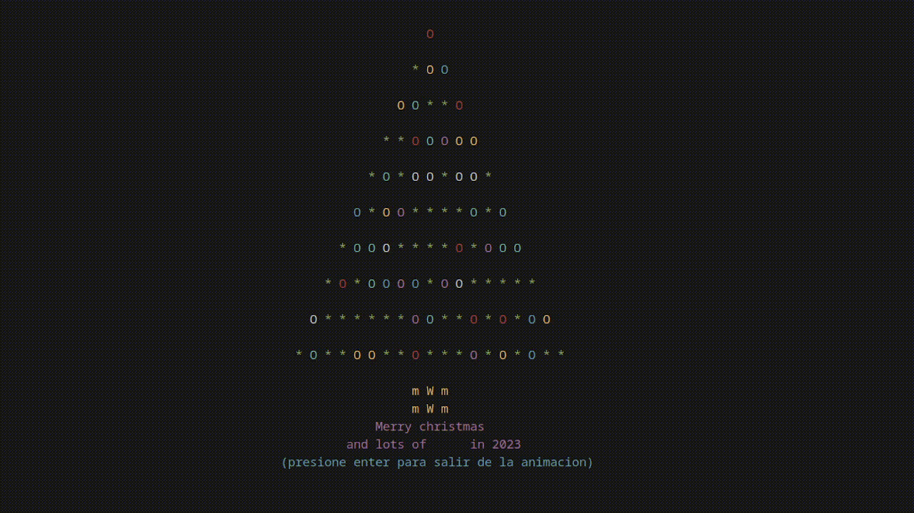

# Description

This is the first final project for the Programming Logic course.  
The program displays an animated Christmas tree with colors, entirely made in the C programming language.  



## Features
- The animation allows you to choose between playing it on specific rows or columns of the tree.
- Includes input character validation.
- Uses `kbhit` to stop the animation.
- Implements the `gotoxy` function to center the Christmas tree on the screen.

> [!IMPORTANT]  
> This project is made completely in spanish, the Code, Menus and on-screen instructions, all will be displayed only in **Spanish**.

---

## Compilation

### Windows
1. Install the `gcc` compiler through [MSYS2](https://www.msys2.org/).

### For Linux, Windows, or MacOS
2. Compile the program with the following command:
   ```bash
   gcc C-hristmas_Tree.c -o C-hristmas_Tree