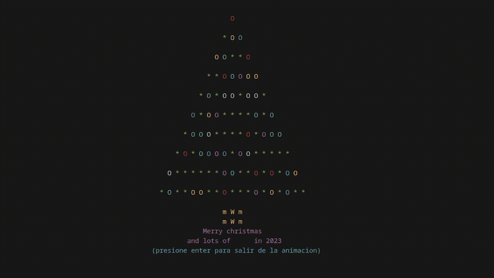

# Descripción 

Este es el primer proyecto final para la materia de Lógica de Programación.  
El programa muestra la animación de un árbol de Navidad con colores, hecho completamente en lenguaje C.  



## Características
- La animación permite elegir entre reproducirla en filas o columnas específicas del árbol.
- Incluye validación de caracteres de entrada.
- Utiliza `kbhit` para detener la animación.
- Implementa la función `gotoxy` para centrar el árbol de Navidad en la pantalla.


---

## Compilación

### Windows
1. Instalar el compilador `gcc` a través de [MSYS2](https://www.msys2.org/).

## Para Linux, Windows o MacOS
2. Compilar el programa con el siguiente comando:
   ```bash
   gcc C-hristmas_Tree.c -o C-hristmas_Tree
   ```